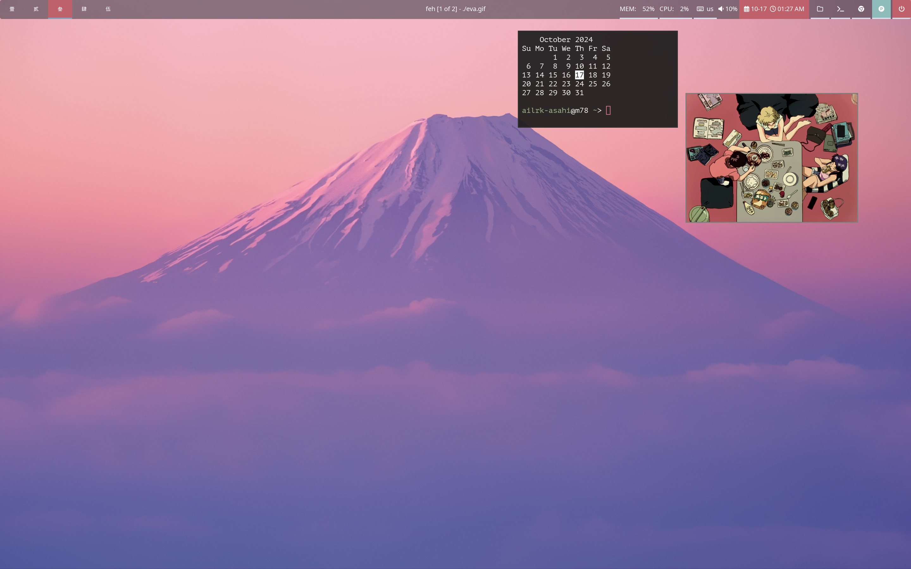

# Kirby: my nix pc config

Kirby is my home manager configuration for linux machine, it lets you customize for different users while sharing the same configurations for commonly used programs. `program/` and `service/` folders contains configurations that can be reused, `user` contains the main user config.

